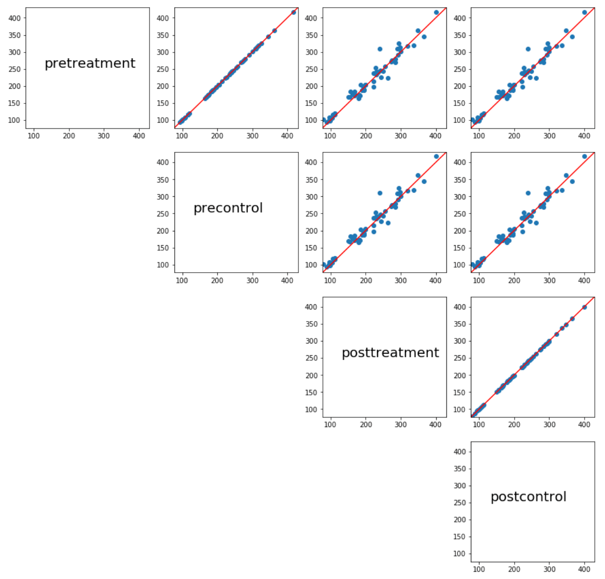
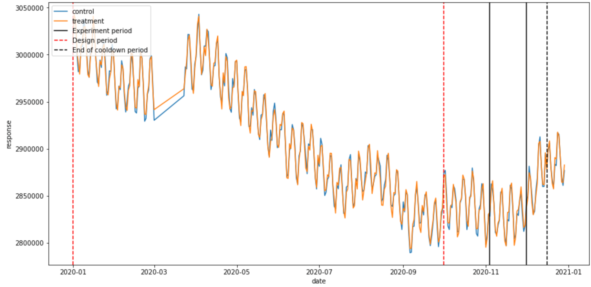
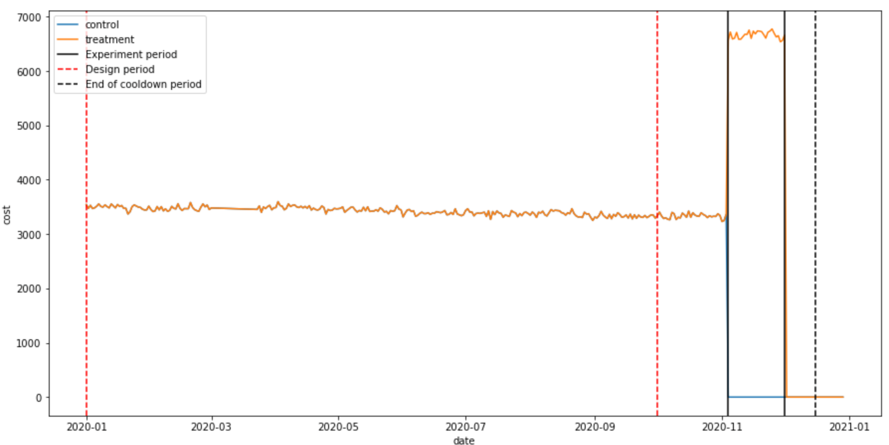
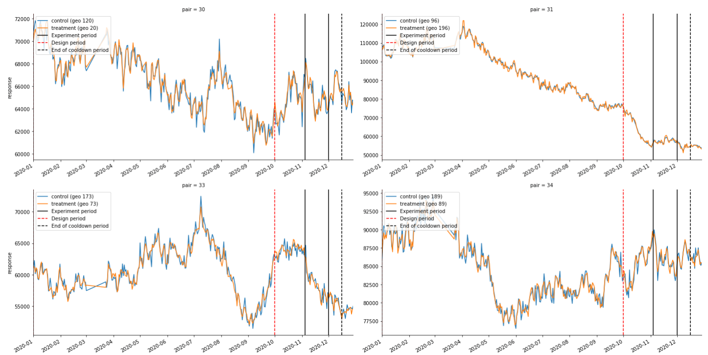

# Trimmed Match Post Analysis Colab Guide

**Authors**: Marco Longfils

With input from Isabel Marcin, Kate O’Donovan, Nicolas Remy and Aiyou Chen

Last updated on Jan 22, 2021

The purpose of this document is to guide you step by step in using Trimmed Match
to analyze a randomized geo experiment with a matched pairs design. For a
general introduction to Trimmed Match, please refer to the
[paper](https://research.google/pubs/pub48448/), and this
[introduction](http://www.unofficialgoogledatascience.com/2016/06/estimating-causal-effects-using-geo.html)
to geo experiments. The colab can be found
[here](https://colab.sandbox.google.com/github/google/trimmed_match/blob/master/trimmed_match/notebook/post_analysis_colab_for_trimmed_match.ipynb).

[TOC]

## Datasets needed to run the Colab

### experiment\_table:

**Description**: this table contains the response and spend data at the geo
level and at daily/weekly frequency. The table should be specified in the colab
by using the URL of the Google Sheet.

**Format**: Google Sheet containing the following mandatory columns: date,
response, cost, geo, assignment (1=Treatment, 2=Control), pair. Any additional
column is ok.

**Example**:
[here](https://github.com/google/trimmed_match/blob/master/trimmed_match/example_datasets/example_data_for_post_analysis.csv)

## Cell by cell description of the colab

### Data Input

#### Cell 1

[[View in colab](https://colab.research.google.com/github/google/trimmed_match/blob/master/trimmed_match/notebook/post_analysis_colab_for_trimmed_match.ipynb#scrollTo=eSnK4_3zaCCW)]

**Description**: This cell will install and load the necessary libraries and
build the C++ wrapper for the TrimmedMatch library. It can take some time to run
this cell.

**Action needed**: Before running the first cell, make sure to update the Google
Sheet url.

### Analysis of the experiment with TrimmedMatch

#### Cell 2

[[View in colab](https://colab.research.google.com/github/google/trimmed_match/blob/master/trimmed_match/notebook/post_analysis_colab_for_trimmed_match.ipynb#scrollTo=fR2v9cJdcn1G)]

**Description**: Select the parameters of the experiment. Briefly, we need to
specify three time periods by specifying their start and end dates, which will
be used for different purposes:

1.  **Test period**: period of time in which the experiment was run.
2.  **Design evaluation period**: period of time used to evaluate the design
    during pretest. This corresponds to the time period within the dates
    **eval\_start\_date** and **eval\_end\_date** used in the
    [design colab](https://colab.sandbox.google.com/github/google/trimmed_match/blob/master/trimmed_match/notebook/design_colab_for_trimmed_match.ipynb)
3.  **Cooldown period**: cooldown period after the conclusion of the experiment,
    typically two weeks.

*   **test\_start\_date** indicates the first day in the test period.
*   **test\_end\_date** indicates the last day in the test period.
*   **cooldown\_end\_date** indicates the last day in the cooldown period.
*   **design\_eval\_start\_date** indicates the first day in the design period.
*   **design\_eval\_end\_date** indicates the last day in the design period.
*   **average\_order\_value** is the mean value in dollars that the client
    attributes to a transaction/visit/contract. Use a value of 1 if the
    experiment is based on sales/revenue or an actual average order value (e.g.
    80$) for an experiment based on transactions/footfall/contracts. The default
    value is 1. N.B.: make sure to use a value of 1 if the response variable of
    interest is revenue/sales. The analysis is still performed on
    transactions/visits/contracts and we only convert the iROAS estimate using
    the average order value.
*   **pairs\_exclude** can be used to list all pairs of geos, separated by a
    comma, which should be excluded from the post analysis. The default value is
    an empty field. The reasons to exclude a pair includes (but are not limited
    to):
    *   The pairing quality has deteriorated sharply after the design but before
        the experiment started.

Example

{style="display:block;margin:auto"}

Pairs should be manually removed from the experiment **if and only if** there is
a clear reason to do so, even if that particular pair is trimmed in the Trimmed
Match analysis. Below we propose a list of possible motivations to manually
remove a pair:

1.  Adverse and severe weather conditions
2.  Lockdowns/curfews that limit either the operations of the stores (e.g.
    opening hours) or the ability and/or the shopping behaviour of the customers
3.  In a small geo (e.g. with 1 or 2 stores in total) one store gets closed
    during one week of the test due to renovation, and the client did not inform
    us about this possible disruption.

Note that “I’m getting better results (tighter confidence intervals or higher
iROAS) when pairs X and Y are manually removed” is not a valid reason to remove
pairs, and we strongly discourage such procedure. Unjustifiable removal of pairs
will compromise the fairness and objectiveness of the analysis’ results.

Before you proceed with the manual removal of a pair, even if you think you have
reason to do so, be sure to:

1.  Back up your claim with hard metrics. If there was a disruption of any type
    in the operations, this should be reflected in the response variable (e.g.
    revenue or transactions should go down if a store is closed/has limited
    access).
2.  If working with a client/third party stores, confirm with them whether they
    agree with your findings and can confirm whether the particular pair you
    would like to remove should not be considered in the analysis of the GeoX.
    The client often has more insight, but sometimes they don’t share valuable
    information regarding store disruptions.

**Action needed**: update the value of the parameters to the desired levels and
run. The output of this cell contains some summary statistics for the treatment
and control group during the pretest, test, and test plus cooldown periods.

{style="display:block;margin:auto";width="400" height="400"}

Additionally, the scatterplot of the average response for treatment and control
groups are produced for the different time periods (pretest, and test).
Pre-treatment vs pre-control and post-treatment vs post-control give an
indication of the goodness of the match/pairing. For example, any point in these
two subplots (pre vs pre and post vs post) that deviates significantly from the
identity line (in red) could indicate a pair which has become mismatched.

The subfigures showing the scatterplot of pre-treatment vs post-treatment, and
pre-control vs post-control can show a change in average response, for example
due to seasonality (e.g. the experiment was designed using December data where
the revenue was higher, and the experiment was run in January).

{style="display:block;margin:auto"}

#### Cell 3

[[View in colab](https://colab.research.google.com/github/google/trimmed_match/blob/master/trimmed_match/notebook/post_analysis_colab_for_trimmed_match.ipynb#scrollTo=mit6ZMs5nMSO)]

**Description**: aggregated (treatment vs control) and pairwise time series plot
of the response variable for the pairs of geos which have not been removed. The
title of each subpanel indicates which pair is plotted, with the two geos and
their assignment (control, treatment) shown in the legend. The experiment period
is enclosed in the two vertical black (solid) lines, the design period in the
two vertical red lines, and the end of the cooldown period is indicated by the
dashed vertical black line.

{style="display:block;margin:auto";width="400" height="400"}

Similar figure for cost below

{style="display:block;margin:auto";width="400" height="400"}

Finally, the pairwise response for each pair included in the experiment, which
can be helpful to inspect mismatched pairs or disrupted geos (for example, all
store in one geo were closed due to an hurricane, and so had no revenue)

{style="display:block;margin:auto"}

**Action needed**: run the cell.

#### Cell 4

[[View in colab](https://colab.research.google.com/github/google/trimmed_match/blob/master/trimmed_match/notebook/post_analysis_colab_for_trimmed_match.ipynb#scrollTo=aAWhBsrbpzLm)]

Description: print the summary of the results from Trimmed Match using only the
test period (without the cooldown period), as shown below. The results contain
the point estimate for the iROAS, the confidence interval.

{style="display:block;margin:auto"}

For diagnostic purposes, one can show the list of trimmed pairs with the
following command

```
    print(f"The following pairs have been trimmed:{results_with_cd.trimmed_pairs}")
```

Which outputs the following

{style="display:block;margin:auto";width="100" height="50"}

We recommend to look more closely at the trimmed pairs only if you are very
familiar with Trimmed Match.

**Action needed**: run the cell.

#### Cell 5

[[View in colab](https://colab.research.google.com/github/google/trimmed_match/blob/master/trimmed_match/notebook/post_analysis_colab_for_trimmed_match.ipynb#scrollTo=BrDaNzpYtYuP)]

**Description**: Similar to Cell 4, expect that in this cell the results include
the cooldown period, which could contain some delayed conversions from the
experiment. The format of the output is identical to the one presented in the
description of Cell 4.

**Action needed**: run the cell.
